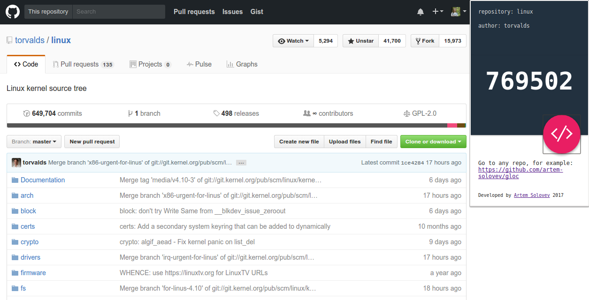
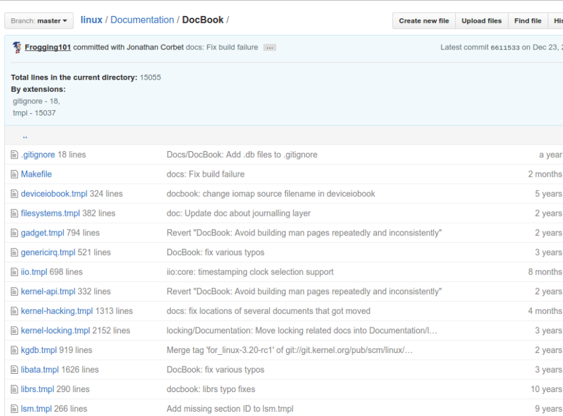

# Chrome extension [GLOC](https://chrome.google.com/webstore/detail/gloc-github-counter-lines/kaodcnpebhdbpaeeemkiobcokcnegdki?utm_source=chrome-ntp-icon)
## **Current version: 2.0.1** ( 2017, 12 feb )

## Description
Github lines of code counter (GLOC). Counts the number of lines of code of a project from github project page.

## **Quick links**
* **[Issues, bugs](https://github.com/artem-solovev/gloc/issues)**

## Screens

## Installation
1. Go to `More tools` --> `Extensions`
2. Scroll below and click `Get more extensions`
3. Search `gloc` --> and click `Add to Chrome`

## **Contributors**
* [Artem Solovev](https://github.com/artem-solovev)
